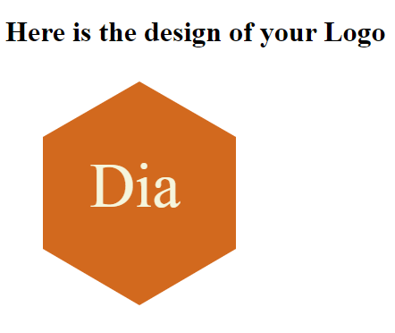

  > # SVG Logo Generator

  >

  > ## Table of Contents

  1. [Description:](#description)
  2. [Installation:](#installation)
  3. [Usage:](#usage)
  4. [How to Contribute:](#how-to-contribute)
  
  6. [Test Instructions:](#test-instructions)
  7. [Questions:](#questions)

  > ## Description

  The application prompts the user to select a color and shape, provide text for the logo, and save the generated SVG to a `.svg` file.

* Screen shot:

  

* Video:

  [![Watch the video]](https://app.screencastify.com/v2/manage/videos/KnzWM0Ig53bEBpdSQupQ)

### User Story

```md
AS a freelance web developer
I WANT to generate a simple logo for my projects
SO THAT I don't have to pay a graphic designer
```

## Acceptance Criteria

```md
GIVEN a command-line application that accepts user input
WHEN I am prompted for text
THEN I can enter up to three characters
WHEN I am prompted for the text color
THEN I can enter a color keyword (OR a hexadecimal number)
WHEN I am prompted for a shape
THEN I am presented with a list of shapes to choose from: circle, triangle, and square
WHEN I am prompted for the shape's color
THEN I can enter a color keyword (OR a hexadecimal number)
WHEN I have entered input for all the prompts
THEN an SVG file is created named `logo.svg`
AND the output text "Generated logo.svg" is printed in the command line
WHEN I open the `logo.svg` file in a browser
THEN I am shown a 300x200 pixel image that matches the criteria I entered
```

  > ## Installation

  1. Clone the repository.
  2. Install dependencies by typing `npm i` in the CLI.
  3. Run `node index.js`

  > ## Usage

  To generate a logo using various geometric shapes.
  
  > ## How to Contribute

  Create a pull request or raise an issue.
  
  >

  > ## Test Instructions

  N/A
  
  > ## Questions

  If you have any question please visit my GitHub at: [djubara](https://github.com/djubara) or send me an email to: <djubara@hotmail.com>
